# 29.06.2019 Kubernetes Workshop

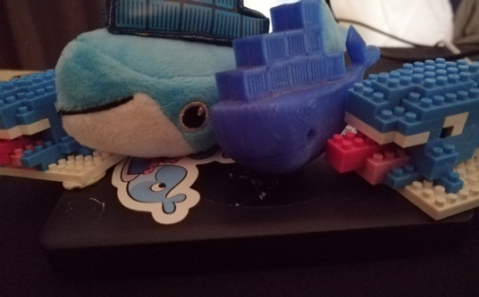

This is to hold the slides and all demo material for the meetup / workshop

## Requirements

- git [***source control system***]
- Docker Desktop [***container management tool***]

`Download the Docker Desktop application and install, if on Windows 10 switch to Linux context by clicking the Switch to Linux option from the whale in the tray.`

## Intro to Docker - Docker 101

### What is Docker?

Docker is a tool designed to make it easier to create, deploy, and run applications by using containers. Containers allow a developer to package up an application with all of the parts it needs, such as libraries and other dependencies, and ship it all out as one package.

### Dockerfile

`Navigate to the folder: 15.06.2019.Kubernetes.Workshop/demo/dockerfile`

A documented specification what how to create your application so that it can be executed.

**Example:**

    FROM node:11 AS build
    LABEL CLI-VERSION="6.0.0"
    RUN useradd --user-group --create-home --shell /bin/false app
    ENV HOME=/home/app
    WORKDIR $HOME
    RUN npm install -g @angular/cli@6.0.0 \
        && npm install @angular/compiler-cli@6.0.0 --save \
        && npm install yarn
    COPY awesome-sauce .
    RUN yarn install
    RUN ng build

    FROM nginx
    ADD default.conf /etc/nginx/conf.d/default.conf
    COPY --from=build /home/app/dist/awesome-sauce /usr/share/nginx/html
    EXPOSE 80

### Docker Image

A compiled specification of your software stored in a repository.

    docker build .

**Example: Docker will get the missing images**

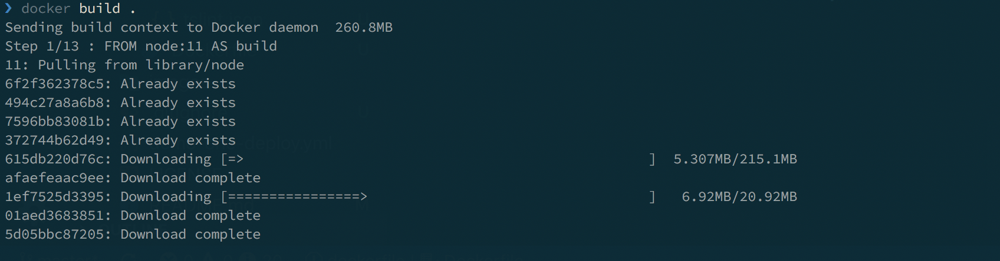

**Example**

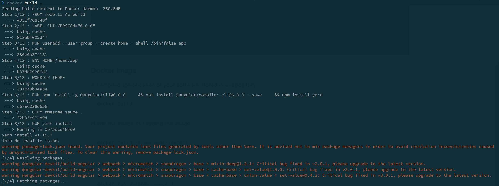

After the build you can see the images created by running:

    docker images

**Example: docker images untagged**

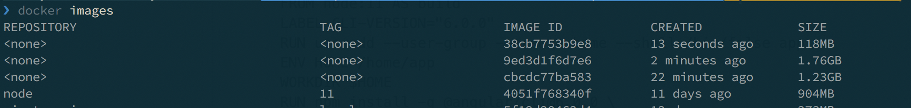

Name the image by tagging the image:

    docker build -t awesome-sauce:1 .

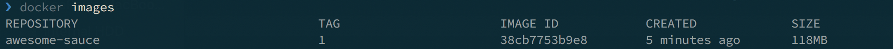

### Run Image as a container

    docker run -d -p 81:80 --rm awesome-sauce:1

Break down this command:

    [docker runtime] [action] -[option: detached] -[option: bind ports] -[option: remove if existed] [image: required image]

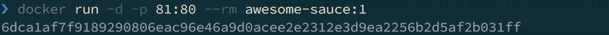
Open the browser and go to [http://localhost:81](http://localhost:81):

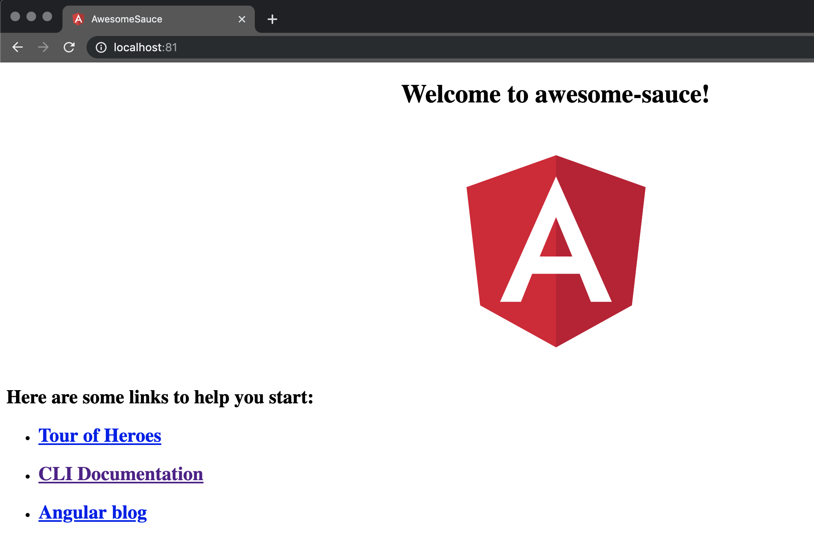

### Checking Containers

A quick way to get a list of the running containers is by running:

    docker ps

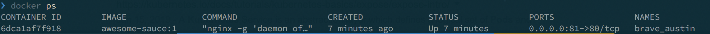

### Stop the container

To stop the container, use the name for the container from the docker ps command and run the docker kill <container-name>.

    docker kill brave_austin

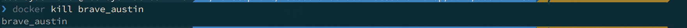

### Sharing Images

### Login

To push images you need to login to the image repository, after creating an account on Docker Hub, simply run:

    docker login -u <username> -p <password>

**Example:**

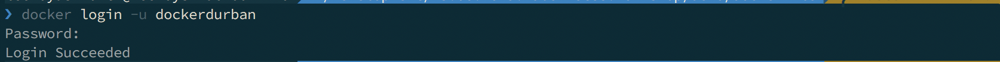

Share your image with others as sharing is caring.
After creating the repository on docker Hub, lets re-tag the image as per the Docker hub repository by running:

    docker tag <image-hash> <new-name>

**Example:**

    docker tag 38cb7753b9e8 dockerdurban/awesome-sauce

Now that we have a image tagged in our accounts namespace we can simply push the image:

    docker push dockerdurban/awesome-sauce:1

**Example:**

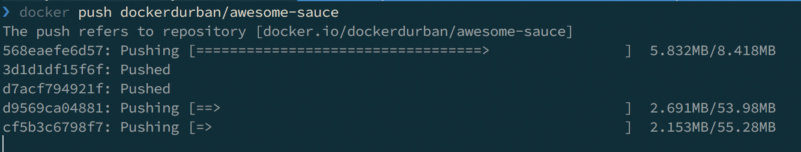

To see the pushed image open a browser and go to: [dockerdurban/awesome-sauce](https://cloud.docker.com/repository/registry-1.docker.io/dockerdurban/awesome-sauce).

### Docker Compose

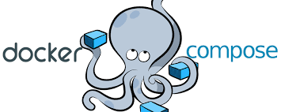

Docker comes with a tool to orchestrate your applications in a simple manner with a .yml file definition.

`Navigate to the folder: 15.06.2019.Kubernetes.Workshop/demo/docker-compose`

**Example:**

    version: '3'

    services:
        web:
          image: awesome-sauce:1
          ports:
              - '8090:80'
        cache:
          image: redis:alpine

In this folder we have the docker-compose.yml which has the stack specification that is required for a deployment.

- website that we created
- some backend service, in this example a redis server

To run the deployment you can use the command `docker-compose up` in the directory that you have the file.

    docker-compose up

**Example**

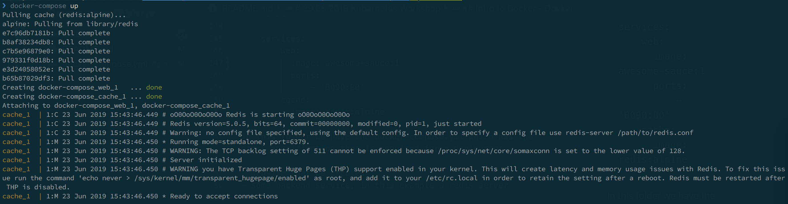

Open the browser to the port in the docker-compose.yml file i.e. 8090

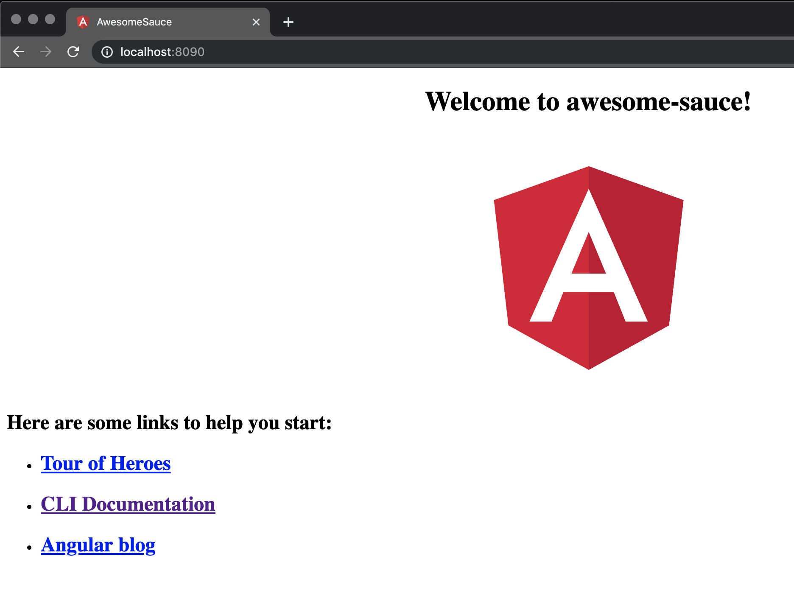

To bring the deployment down simple cancel the terminal and the engine will gracefully kill the containers.

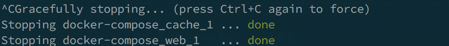

To run the deployment as a service run:

    docker-compose up -d

**example**

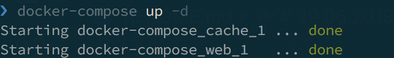

To see what deployments are running run the command:

    docker-compose ps

**Example:**

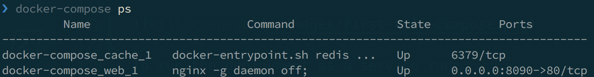

That will detach the terminal and the deployment will run. To remove the deployment run the command:

    docker-compose down

**Example:**

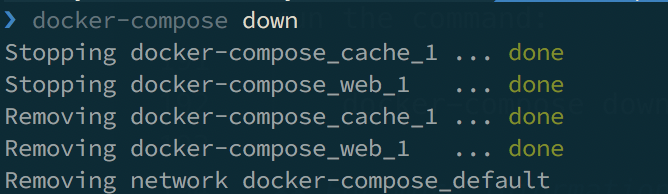

**_For more information check out [Docker-Compose Deploy Stack](https://docs.docker.com/engine/swarm/stack-deploy/)_**

## Kubernetes : 101

### What is Kubernetes

Kubernetes is an open-source container-orchestration system for automating application deployment, scaling, and management.

It was originally designed by Google, and is now maintained by the Cloud Native Computing Foundation.

`Navigate to the folder: 15.06.2019.Kubernetes.Workshop/demo/kubernetes`

### Get Kubernetes on your machine

Click on the Docker desktop application, then click preferences / settings select Kubernetes and check enable Kubernetes.

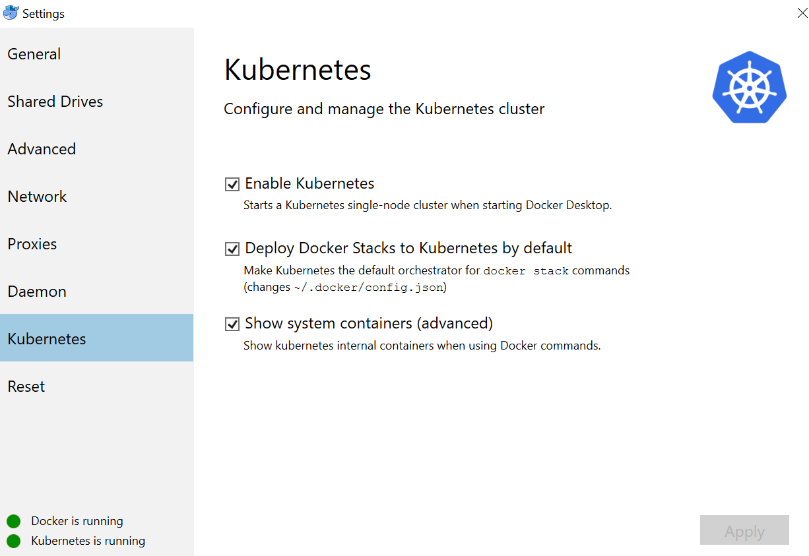

## kubectl

kubectl controls the Kubernetes cluster manager.

### Check that all is working

kubectl get nodes

### Orchestration

Docker comes with swarm as the default orchestrator, you can set the orchestrator for all deployments or set it when deploying the stack.

- set DOCKER_STACK_ORCHESTRATOR=swarm
- set DOCKER_STACK_ORCHESTRATOR=kubernetes

Set the orchestrator when deploying:

    docker stack deploy --orchestrator kubernetes --compose-file demo-one-deploy.yml demo-one-stack

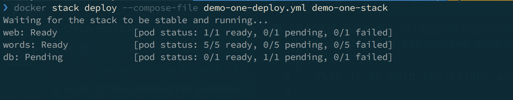

    kubectl get pods

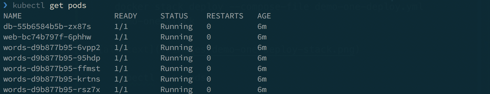

### Remove Stack

    docker stack rm demo-one-stack

## Kubernetes top level

- **kubectl apply** : Manages applications through files defining Kubernetes resources. It creates and updates resources in a cluster.

**Examples**

    kubectl apply -f ./my-manifest.yaml           # create resource(s)
    kubectl apply -f ./my1.yaml -f ./my2.yaml     # create from multiple files
    kubectl apply -f ./dir                        # create resource(s) in all manifest files in dir
    kubectl apply -f https://git.io/vPieo         # create resource(s) from url
    kubectl create deployment nginx --image=nginx  # start a single instance of nginx
    kubectl explain pods,svc                       # get the documentation for pod and svc manifests

- **kubectl get services**: List all services in the namespace
- **kubectl get pods --all-namespaces**: List all pods in all namespaces
- **kubectl get deployment my-dep**: List a particular deployment
- **kubectl describe pods my-pod**: Describe commands with verbose output

**_For more check out [kubectl Cheat Sheet](https://kubernetes.io/docs/reference/kubectl/cheatsheet/)_**

## Kubernetes Dashboard

    kubectl apply -f https://raw.githubusercontent.com/kubernetes/dashboard/v1.10.1/src/deploy/recommended/kubernetes-dashboard.yaml

Now set the proxy so that you can navigate to the dashboard

    kubectl proxy

Copy and paste into a browser:

    http://localhost:8001/api/v1/namespaces/kube-system/services/https:kubernetes-dashboard:/proxy/

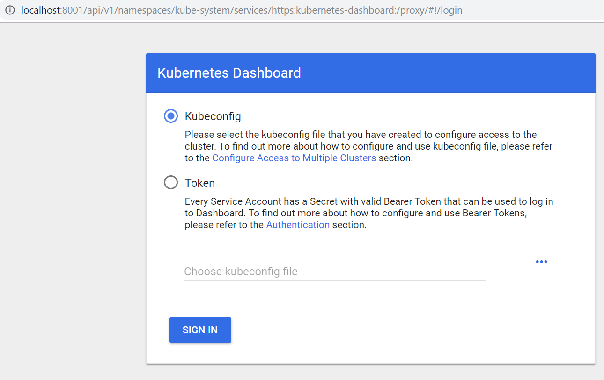

### Get the token from kubctl

    $TOKEN=((kubectl -n kube-system describe secret default | Select-String "token:") -split " +")[1]

### Set the token to the cluster

    kubectl config set-credentials docker-for-desktop --token="${TOKEN}"

### Set the config file to the dashboard

- Click on Kubeconfig and select the “config” file under /users/<username>.kube\config

Once logged in you will see the dashboard.

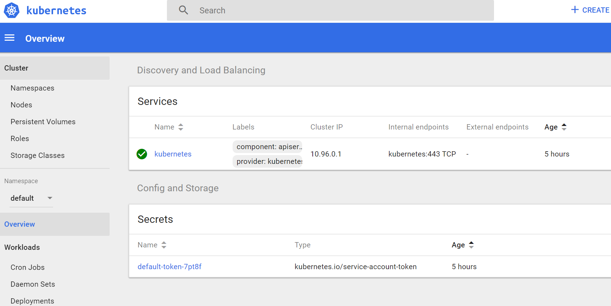

### Nodes in your cluster

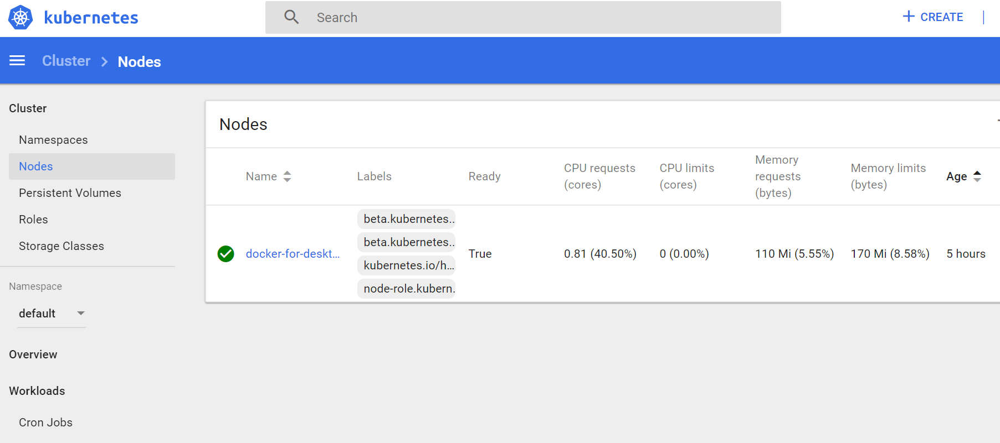

### Roles in your cluster

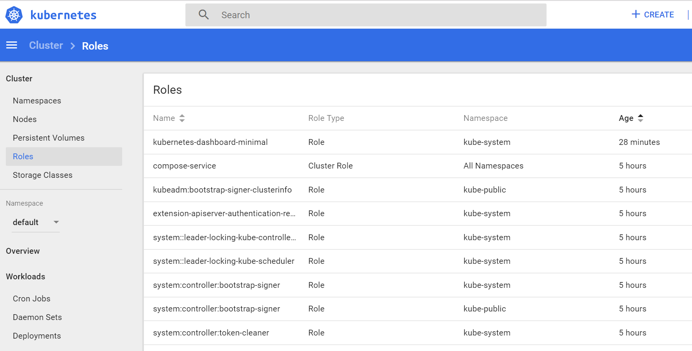

To Stop the dashboard simply exit the proxy command from earlier.

## Terminology

## Pod

A unit of work, contains one or more containers

### Node

A worker machine in Kubernetes, part of a cluster.

### Cluster

A set of Nodes that run containerized applications managed by Kubernetes. For this example, and in most common Kubernetes deployments, nodes in the cluster are not part of the public internet.

### Service

A Kubernetes Service that identifies a set of Pods using label selectors. Unless mentioned otherwise, Services are assumed to have virtual IPs only routable within the cluster network.

### Demo

    kubectl apply -f awesome-sauce-deploy.yaml
